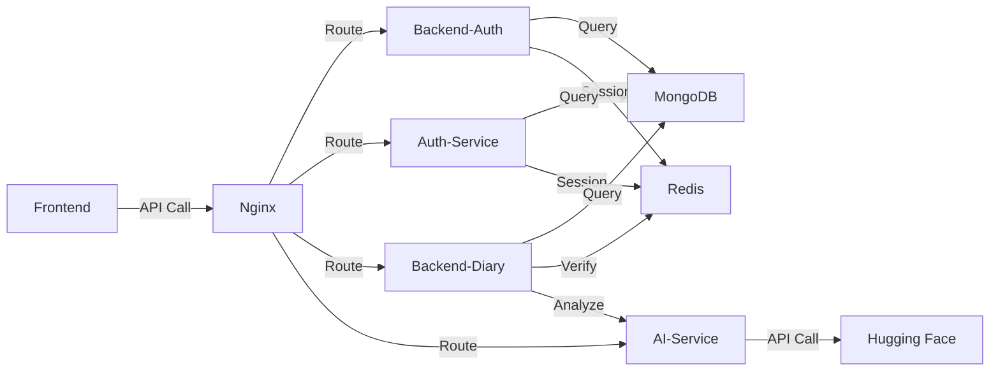

# 📊 프로젝트 폴더 구조 분석

## 🎯 전체 구조 개요

```
pet-diary-app/
├── 🔧 docker-compose.yml       (오케스트레이션)
├── 🔒 .env                      (환경 변수)
│
├── 🔀 nginx/                    (역방향 프록시)
│   └── nginx.conf
│
├── ⚛️ frontend/                 (프론트엔드)
│   ├── Dockerfile
│   ├── package.json
│   └── src/
│       ├── app.js              (메인 앱)
│       └── pages/              (페이지 컴포넌트)
│           ├── LoginPage.js
│           ├── RegisterPage.js
│           ├── DiaryListPage.js
│           ├── CreateDiaryPage.js
│           ├── EditDiaryPage.js
│           └── PublicFeedPage.js
│
├── 🔐 backend-auth/             (인증 서비스 1)
│   ├── Dockerfile
│   ├── package.json
│   ├── index.js                (메인 서버)
│   └── models/
│       └── User.js             (사용자 모델)
│
├── 🔐 auth-service/             (인증 서비스 2)
│   ├── Dockerfile
│   ├── package.json
│   └── server.js               (메인 서버)
│
└── 📝 backend-diary/            (일기 서비스)
    ├── Dockerfile
    ├── package.json
    ├── index.js                (메인 서버)
    ├── middleware/
    │   └── authMiddleware.js   (인증 미들웨어)
    ├── models/
    │   └── Diary.js            (일기 모델)
    └── uploads/                (이미지 저장소)
```

---

## 🔍 각 계층 상세 분석

### 1️⃣ 인프라 계층 (Infrastructure)

#### docker-compose.yml
```yaml
역할: 모든 컨테이너 오케스트레이션
- Nginx (포트 80)
- Frontend (포트 3000)
- Backend-Auth (포트 4001)
- Auth-Service (포트 4003)
- Backend-Diary (포트 4002)
- AI-Service (포트 5000)
- MongoDB (포트 27017)
- Redis (포트 6379)
```

#### .env
```bash
역할: 환경 변수 중앙 관리
- MONGO_URI
- REDIS_HOST
- JWT_SECRET
- HF_API_KEY
```

---

### 2️⃣ 프록시 계층 (Proxy Layer)

#### nginx/
```
📁 nginx/nginx.conf

역할: 역방향 프록시 및 라우팅
- /              → Frontend (React)
- /api/auth/    → Backend-Auth
- /api/auth-alt/→ Auth-Service
- /api/diary/   → Backend-Diary
- /api/ai/      → AI-Service
- /uploads/     → Static Files
```

**라우팅 흐름:**
```
Client Request → Nginx (80) → 적절한 서비스로 라우팅
```

---

graph TB
    Client[👤 Client Browser<br/>사용자]
    
    subgraph Docker Network
        Nginx[🔀 Nginx<br/>Reverse Proxy<br/>Port: 80<br/>📁 nginx/]
        
        subgraph Frontend Layer
            React[⚛️ Frontend<br/>React SPA<br/>Port: 3000<br/>📁 frontend/<br/><br/>Pages:<br/>- LoginPage<br/>- RegisterPage<br/>- DiaryListPage<br/>- CreateDiaryPage<br/>- EditDiaryPage<br/>- PublicFeedPage]
        end
        
        subgraph Backend Services
            Auth1[🔐 Auth Service 1<br/>Node.js + Express<br/>JWT + Session<br/>Port: 4001<br/>📁 backend-auth/<br/><br/>Models:<br/>- User.js]
            
            Auth2[🔐 Auth Service 2<br/>Node.js + Express<br/>Alternative Auth<br/>Port: 4003<br/>📁 auth-service/]
            
            Diary[📝 Diary Service<br/>Node.js + Express<br/>CRUD + File Upload<br/>Port: 4002<br/>📁 backend-diary/<br/><br/>Models:<br/>- Diary.js<br/>Middleware:<br/>- authMiddleware.js]
            
            AI[🤖 AI Service<br/>Python + FastAPI<br/>Image Analysis<br/>Port: 5000<br/>📁 ai-service/]
        end
        
        subgraph Data Layer
            Mongo[(🗄️ MongoDB<br/>Users & Diaries<br/>Port: 27017)]
            Redis[(💾 Redis<br/>Session Store<br/>Port: 6379)]
            Files[📁 Uploads<br/>Image Files<br/>backend-diary/uploads/]
        end
        
        HF[🌐 Hugging Face API<br/>BLIP Vision Model<br/>KoGPT-2 LLM]
    end
    
    Client -->|HTTP Request| Nginx
    
    Nginx -->|/| React
    Nginx -->|/api/auth/*| Auth1
    Nginx -->|/api/auth-alt/*| Auth2
    Nginx -->|/api/diary/*| Diary
    Nginx -->|/api/ai/*| AI
    Nginx -->|/uploads/*| Files
    
    React -.->|API Calls| Nginx
    
    Auth1 <-->|User CRUD| Mongo
    Auth1 <-->|Session| Redis
    
    Auth2 <-->|User CRUD| Mongo
    Auth2 <-->|Session| Redis
    
    Diary <-->|Diary CRUD| Mongo
    Diary <-->|Session Verify| Redis
    Diary -->|Image Storage| Files
    Diary -->|AI Request| AI
    
    AI -->|Image Analysis| HF
    
    style Client fill:#e3f2fd
    style Nginx fill:#fff3e0
    style React fill:#e1f5fe
    style Auth1 fill:#f3e5f5
    style Auth2 fill:#f3e5f5
    style Diary fill:#e8f5e9
    style AI fill:#fff9c4
    style Mongo fill:#ffe0b2
    style Redis fill:#ffebee
    style Files fill:#fce4ec
    style HF fill:#e0f2f1

### 3️⃣ 프론트엔드 계층 (Frontend Layer)

#### frontend/
```
📁 frontend/
├── Dockerfile          (React 컨테이너)
├── package.json        (의존성 관리)
└── src/
    ├── app.js          (메인 애플리케이션)
    └── pages/          (페이지별 컴포넌트)
```

**페이지 구조:**
```javascript
pages/
├── LoginPage.js        // 로그인
├── RegisterPage.js     // 회원가입
├── DiaryListPage.js    // 일기 목록 (본인 것)
├── CreateDiaryPage.js  // 일기 작성
├── EditDiaryPage.js    // 일기 수정
└── PublicFeedPage.js   // 공개 피드 (모든 사용자)
```

**컴포넌트 역할:**
| 페이지 | API 호출 | 주요 기능 |
|--------|---------|-----------|
| LoginPage | POST /api/auth/login | 로그인 → 토큰 저장 |
| RegisterPage | POST /api/auth/register | 회원가입 |
| DiaryListPage | GET /api/diary/ | 내 일기 목록 |
| CreateDiaryPage | POST /api/diary/ | 이미지 업로드 + AI 일기 생성 |
| EditDiaryPage | PUT /api/diary/:id | 일기 수정 |
| PublicFeedPage | GET /api/diary/public | 공개 일기 피드 |

---

### 4️⃣ 백엔드 서비스 계층 (Backend Services)

#### 🔐 backend-auth/ (인증 서비스 1)
```
📁 backend-auth/
├── Dockerfile
├── package.json
├── index.js            (메인 서버 파일)
└── models/
    └── User.js         (사용자 스키마)

포트: 4001
엔드포인트:
- POST /register    (회원가입)
- POST /login       (로그인)
- POST /verify      (토큰 검증)
- POST /logout      (로그아웃)
```

**User 모델:**
```javascript
{
  _id: ObjectId,
  username: String,
  email: String,
  password: String (hashed),
  createdAt: Date
}
```

#### 🔐 auth-service/ (인증 서비스 2)
```
📁 auth-service/
├── Dockerfile
├── package.json
└── server.js           (메인 서버 파일)

포트: 4003
역할: Alternative 인증 시스템 (백업/테스트용?)
엔드포인트: backend-auth와 동일
```

**🤔 왜 인증 서비스가 2개?**
1. **로드 밸런싱**: 트래픽 분산
2. **A/B 테스트**: 서로 다른 인증 방식 테스트
3. **백업 시스템**: 하나 다운되면 다른 것 사용
4. **마이크로서비스 연습**: 서비스 분리 학습

#### 📝 backend-diary/ (일기 서비스)
```
📁 backend-diary/
├── Dockerfile
├── package.json
├── index.js                    (메인 서버)
├── middleware/
│   └── authMiddleware.js       (토큰 검증)
├── models/
│   └── Diary.js                (일기 스키마)
└── uploads/                    (이미지 파일 저장)

포트: 4002
엔드포인트:
- POST   /           (일기 생성 + AI 분석)
- GET    /           (내 일기 목록)
- GET    /public     (공개 일기 피드)
- GET    /:id        (일기 상세)
- PUT    /:id        (일기 수정)
- DELETE /:id        (일기 삭제)
```

**Diary 모델:**
```javascript
{
  _id: ObjectId,
  user: ObjectId (ref: User),
  title: String,
  content: String,
  imageUrl: String,
  aiAnalysis: {
    species: String,
    action: String
  },
  isPublic: Boolean,
  createdAt: Date
}
```

**authMiddleware.js 역할:**
```javascript
1. 요청에서 JWT 토큰 추출
2. Redis에서 세션 확인
3. 유효하면 req.user에 사용자 정보 저장
4. 무효하면 401 에러 반환
```

---

### 5️⃣ 데이터 계층 (Data Layer)

#### MongoDB
```
역할: 주 데이터베이스
저장 데이터:
- users 컬렉션 (사용자 정보)
- diaries 컬렉션 (일기 데이터)
```

#### Redis
```
역할: 세션 저장소
저장 데이터:
- session:{userId} : JWT 토큰
- TTL: 7일
```

#### uploads/
```
역할: 업로드된 이미지 파일 저장
경로: backend-diary/uploads/
접근: http://localhost/uploads/{filename}
```

---

## 🔄 데이터 흐름

### 시나리오 1: 로그인
```
Client → Nginx → Backend-Auth
         ↓
    Redis (세션 저장)
         ↓
    MongoDB (사용자 조회)
         ↓
    Client (토큰 받음)
```

### 시나리오 2: 일기 생성
```
Client (이미지 선택) 
   ↓
Nginx → Backend-Diary
   ↓
authMiddleware (토큰 검증 via Redis)
   ↓
AI-Service (이미지 분석)
   ↓
Hugging Face API (BLIP + KoGPT-2)
   ↓
MongoDB (일기 저장)
   ↓
uploads/ (이미지 저장)
   ↓
Client (결과 표시)
```

### 시나리오 3: 공개 피드 조회
```
Client → Nginx → Backend-Diary
         ↓
    authMiddleware (인증 확인)
         ↓
    MongoDB (isPublic: true인 일기들)
         ↓
    Client (피드 표시)
```

---

## 📊 서비스 간 통신



---

## 🎯 핵심 설계 원칙

### 1. 관심사의 분리 (Separation of Concerns)
```
✅ 인증 → backend-auth, auth-service
✅ 일기 관리 → backend-diary
✅ AI 분석 → ai-service
✅ 라우팅 → nginx
```

### 2. 단일 책임 원칙 (Single Responsibility)
```
각 서비스는 하나의 역할만 담당
- backend-auth: 오직 인증
- backend-diary: 오직 일기 CRUD
- ai-service: 오직 AI 분석
```

### 3. 느슨한 결합 (Loose Coupling)
```
서비스들이 독립적으로 동작
- backend-diary가 다운되어도 auth는 동작
- ai-service가 느려도 다른 서비스는 정상
```

---

## 🔐 보안 계층

```
Client Request
    ↓
[Nginx] - CORS 설정
    ↓
[authMiddleware] - JWT 검증
    ↓
[Redis] - 세션 확인
    ↓
[Service] - 비즈니스 로직
    ↓
[MongoDB] - 데이터 접근
```

---

## 🚀 확장 가능성

### 수평 확장
```yaml
# docker-compose.yml
backend-diary:
  replicas: 3  # 인스턴스 3개로 증가
  
nginx:
  # 로드 밸런싱 자동 처리
```

### 새 서비스 추가
```
1. 새 디렉토리 생성 (예: backend-comment)
2. Dockerfile 작성
3. docker-compose.yml에 추가
4. nginx.conf에 라우팅 추가
```

---

## 💡 실전 팁

### 개발 순서
```
1. backend-auth 완성 → 테스트
2. backend-diary (AI 제외) → 테스트
3. ai-service 추가 → 통합
4. frontend 페이지별 개발
5. 통합 테스트
```

### 디버깅 순서
```
문제 발생 시:
1. docker-compose logs [service-name]
2. 해당 서비스 컨테이너 들어가기
   docker-compose exec [service] sh
3. 파일 구조 확인
   ls -la
4. 환경 변수 확인
   env
```

---

이 구조는 **실제 운영 환경**에서도 사용할 수 있는 탄탄한 마이크로서비스 아키텍처입니다! 🎊